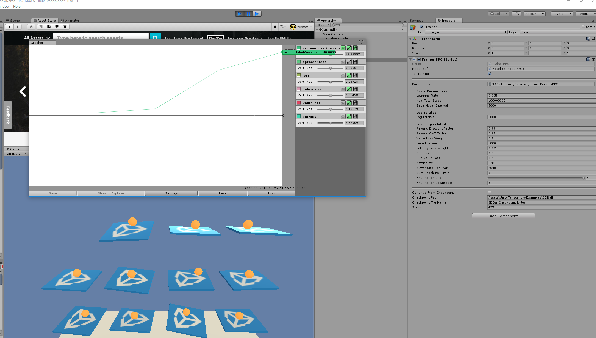

# Getting Started with the 3D Balance Ball Environment

This tutorial walks through the end-to-end process of converting the Unity ML-Agents' 3D Balance Ball environment into one that is trainable directly in Unity editor without coding extra stuff.

If you are not yet familiar with Unity's 3D Balance Ball Environment or you don't understant it at all, go to their [Understanding a Unity Environment (3D Balance Ball)](https://github.com/Unity-Technologies/ml-agents/blob/master/docs/Getting-Started-with-Balance-Ball.md#understanding-a-unity-environment-3d-balance-ball) section to understand what are Academy, Agent and Brain.

In this tutorial, we will use the default learning algorithm PPO(Proximal Policy Optimization) as in Unity ML-Agents.

## Steps
### 1. Copy the scene

In the examples diretories provided by Unity ML-Agents, find the scene 3DBall and duplicate the scene.

    

### 2. Create an Internal Learning Brain
We added a new type of brain called Internal Learning Brain, which should be used for training in game/editor instead of Heuristic Brain, Player Brain or Learning Brain.  
Create a new Internal Learning Brain scriptable object like how you create other type of brains, and copy the brain parameters from other brains provided by Unity ML-Agents for 3DBall environment.

    

### 3. Create the Trainer and Trainer Parameters in the Scene
A trainer is something that handles the training process. 

Add a new GameObject at any place, and attach a script called TrainerPPO.cs to it. In the tutorial, we add it under Ball3DAcademy and name it Ball3DTrainer.

A trainer needs to know which brain to train. Drag the just created Internal Learning Brain to the TrainerPPO's brainToTrain field in the editor.

A trainer ususally needs a set of hyperparameters. Here for TrainerPPO, you need to create a scriptable object called TrainerParamsPPO and assign it to the Parameters field in TrainerPPO. You can also just use the one already created called "3DBallTrainingParams", which has better parameter values than the default one when you create it.

    

Finally check the Is Trainer field in the Trainer. The Trainer in the inspector should look like following. You can adjust the hyper parameters in it if you know what they mean. The trainer should look like below:

    

### 4. Create the Model and Network in the Scene
A model contains the high level interface to use the neural network for different learning algorithm. The trainer will communicate with the model to train the neural network and query actions. 

In our codes, most of models need a Network scripable object to define the detailed structure of the neural network, including how many hidden layers and so on. You can also easily write your own network. 

Add a new GameObject at any place, and attach a script called RLModelPPO.cs to it. Assign this script to the ModelRef field in your TrainerPPO. In the tutorial, we add it under Ball3DAcademy and name it Ball3DModel.

Then, create a RL Network Simple AC scriptable object, which will be the neural network we use. Here AC means Actor Critic, which is a commonly used architecture in reinforcement learning, including PPO. You can also just use the one already created called "3DBallNetworkAC", which has better parameter values than the default one when you create it.

    

Assign this just created RL Netowrk Simple AC scriptable object to the Network field of the RLModelPPO. The Model in the inspector should look like following. You can adjust the network parameters in it if you know what they mean.

    

## Click Play and Start!
You can click Window/Grapher from menu to monitor your training process.(It is a modified version of old Grapher, when it was still free. It seems to be not free nor opensource anymore...I will remove it if it is causing any problem.). The parameters are not well tuned, but the agent should be able to learn something at least within a minute.

You can also toggle the IsTraining field on Ball3DTrainer in inspector to enable/disable training.

The trained data will be saved at the relative path specified in the Checkpoint Path field in Trainer. How often it is saved depends on the trainer parameters.

